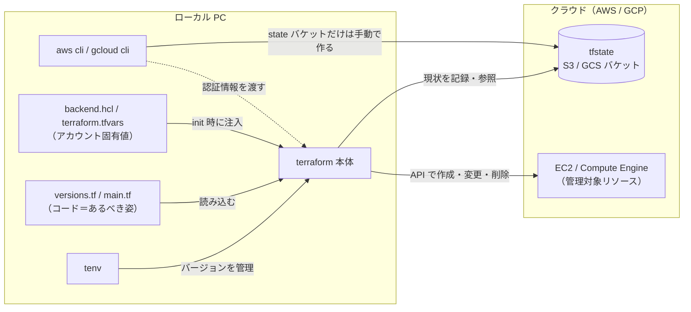

他の人が作った Terraform 環境で plan / apply を打ったことはある。tf ファイルを直してリソースを増やしたこともある。でも、ゼロから `terraform init` が通るところまで自分で組んだことはない——そんな状態の方は意外と多いのではないでしょうか？

筆者も少し前までまさにその状態でしたが、先日 GCP で初めて「最初のセットアップ」を自分でやりました。そのとき詰まった点も含めて手順を残しておきます。AWS 側は同じ流れを標準手順に沿って併記しています。

## この記事の前提

**対象読者**

- Terraform が何かはなんとなく知っている
- 既存の Terraform 環境で plan / apply や tf ファイルの修正はしたことがある
- 初期セットアップ（backend の用意、provider の設定、最初の init）はやったことがない

**用意するもの**

- AWS または GCP のアカウント（課金が有効なもの）
- AWS CLI または gcloud CLI（インストール済みであること）
- Homebrew（tenv を入れるのに使う。別の入れ方でも構わない）

**想定作業時間**: 1 時間くらい。アカウントと CLI の準備ができている前提です。

**料金について**: 立てるのは t3.micro / e2-micro が 1 台と tfstate 用のバケットだけなので、最後の destroy までやれば数円で収まります。消し忘れると課金が続くので、片付けまで必ずセットで。

ゴールは「EC2 または Compute Engine の一覧に、自分が Terraform で立てた VM が 1 台表示されている」状態です。

## 1. 全体像 — 登場人物と関係を先に押さえる

手順に入る前に、これから登場するツールとファイルの関係を整理しておきます。既存環境を触っていた頃の筆者は、このあたりを「なんとなく動いているもの」として素通りしていました。ここが見えると、初期セットアップでやることひとつひとつの意味が一気に分かります。



それぞれの役割は次のとおりです。

- **terraform 本体** — 主役。`.tf` コードを読み、クラウドの API を叩いてリソースを作ります
- **tenv** — terraform 本体のバージョン管理ツール。プロジェクトごとにバージョンを固定・切替できます
- **aws cli / gcloud cli** — 仕事は 2 つ。①ローカルに認証情報を用意する（Terraform はこれを拾って API を叩く）、② state バケットの作成など「Terraform 管理外」の手作業を担当する
- **tfstate** — 「Terraform がいま何を管理しているか」の台帳で、コードと実リソースの対応表。この置き場が S3 / GCS のバケットで、**バケット自体は Terraform 管理外なので手で作ります**（理由は手順 4 で）
- **versions.tf** — terraform 本体と provider のバージョン宣言に加えて、「state をどこに置くか」（backend の種類）もここで宣言します
- **backend.hcl / terraform.tfvars** — バケット名やプロジェクト ID といったアカウント固有値の置き場。コード本体から分離して gitignore します

動きとしては、**コード（あるべき姿）と tfstate（現状）を突き合わせて差分を出すのが plan、差分を実リソースに反映して結果を tfstate に書き戻すのが apply** です。既存環境で打っていたあのコマンドは、この台帳の突き合わせだったわけです。

この関係が頭に入っていれば、以降の手順は「登場人物を順に用意していくだけ」になります。では、始めましょう。

## 2. Terraform を入れる（tenv 経由）

Terraform 本体は、バージョン管理ツールの tenv 経由で入れます。プロジェクトごとにバージョンを固定・切替できるので、最初からこちらに慣れておくのがおすすめです。

このジャンルでは tfenv を紹介している記事が長らく定番でしたが、tenv はその後継にあたるツールで、コマンド体系はほぼ同じまま OpenTofu や Terragrunt にも対応しており、メンテナンスも活発です。いまから始めるなら tenv を選んでおけばよいでしょう。

```bash
brew install tenv
tenv tf install latest
tenv tf use latest
terraform version
```

作業ディレクトリに `.terraform-version` というファイルを置いてバージョンを書いておくと（例: `1.15.6`）、そのディレクトリでは自動的にそのバージョンが使われます。この形式は tfenv 時代からのものですが、tenv もそのまま読んでくれるので、既存プロジェクトが tfenv 前提でも困りません。

> **この時点でできていること**: ローカルで `terraform` コマンドが打てる。クラウド側にはまだ何もない。

## 3. クラウド側の認証

Terraform 自体はどのアカウントに対して操作するかを知らないので、CLI 側で認証を通しておきます。Terraform はこの認証情報を勝手に拾ってくれます。

**AWS**

```bash
aws configure          # アクセスキー・シークレット・リージョンを設定
aws sts get-caller-identity
```

`get-caller-identity` で自分のアカウント ID が返ってくれば OK です。

**GCP**

```bash
gcloud auth login
gcloud config set project <PROJECT_ID>
gcloud auth application-default login
gcloud auth application-default set-quota-project <PROJECT_ID>
```

最後の `set-quota-project` は飛ばしがちですが、飛ばすと `active project does not match the quota project` という警告が出ます。多くの操作はそのままでも動くものの、一部の API で紛らわしい 403 の原因になるので、ここで揃えておくのが安全です（筆者はここで一度引っかかりました）。

> **この時点でできていること**: ローカルからクラウドの API を叩ける。Terraform 用の設定はまだ何もない。

## 4. tfstate の置き場所を先に手で作る

Terraform は「いま何を管理しているか」を tfstate というファイルに記録します。ひとりで試すだけならローカル保存でも動きますが、実務では必ずリモート（S3 / GCS）に置くので、最初からリモートにしておきます。

ここが初期セットアップで一番大事なところです。**state を置くバケットだけは Terraform で作らず、CLI で 1 回だけ手動で作ります。** state の保存先を Terraform で作ろうとすると「state を作るには state の置き場が要る」という鶏と卵になるからです。

**AWS**

```bash
aws s3api create-bucket \
  --bucket <YOUR_NAME>-tfstate \
  --region ap-northeast-1 \
  --create-bucket-configuration LocationConstraint=ap-northeast-1

aws s3api put-bucket-versioning \
  --bucket <YOUR_NAME>-tfstate \
  --versioning-configuration Status=Enabled
```

**GCP**

```bash
gcloud storage buckets create gs://<PROJECT_ID>-tfstate \
  --location=asia-northeast1 --uniform-bucket-level-access

gcloud storage buckets update gs://<PROJECT_ID>-tfstate --versioning
```

バケット名は全世界で一意です。GCP ならプロジェクト ID を、AWS なら自分の名前などを混ぜると衝突しません。バージョニングは state を壊してしまったときの保険なので有効にしておきます。

筆者が初めてやったときは、この手順の存在を知らずに `terraform init` を打って `Error 404: bucket doesn't exist` を食らいました。init が通らないときは、まずバケットが本当に存在するかを疑ってください。

> **この時点でできていること**: tfstate の置き場ができた。Terraform のコードはまだ 1 行もない。

## 5. 最小構成のファイルを書く

作業ディレクトリを切って、ファイルを 4 つ用意します。

```text
terraform-hello/
├── versions.tf        # Terraform / provider のバージョンと backend 宣言
├── main.tf            # 立てたいリソース
├── backend.hcl        # state バケット名（gitignore する）
└── terraform.tfvars   # プロジェクト ID などの環境固有値（gitignore する）
```

### AWS の場合

`versions.tf`:

```hcl
terraform {
  required_version = ">= 1.9.0"
  backend "s3" {}

  required_providers {
    aws = {
      source  = "hashicorp/aws"
      version = "~> 6.0"
    }
  }
}

provider "aws" {
  region = var.region
}

variable "region" {
  default = "ap-northeast-1"
}
```

`main.tf`（Amazon Linux 2023 の最新 AMI を引いて EC2 を 1 台）:

```hcl
data "aws_ami" "al2023" {
  most_recent = true
  owners      = ["amazon"]

  filter {
    name   = "name"
    values = ["al2023-ami-2023*-x86_64"]
  }
}

resource "aws_instance" "hello" {
  ami           = data.aws_ami.al2023.id
  instance_type = "t3.micro"

  tags = {
    Name = "terraform-hello"
  }
}
```

`backend.hcl`:

```hcl
bucket       = "<YOUR_NAME>-tfstate"
key          = "hello/terraform.tfstate"
region       = "ap-northeast-1"
use_lockfile = true
```

### GCP の場合

`versions.tf`:

```hcl
terraform {
  required_version = ">= 1.9.0"
  backend "gcs" {}

  required_providers {
    google = {
      source  = "hashicorp/google"
      version = "~> 6.0"
    }
  }
}

provider "google" {
  project = var.project_id
  region  = var.region
  zone    = "${var.region}-a"
}

variable "project_id" {}

variable "region" {
  default = "asia-northeast1"
}
```

`main.tf`（e2-micro を 1 台）:

```hcl
resource "google_compute_instance" "hello" {
  name         = "terraform-hello"
  machine_type = "e2-micro"

  boot_disk {
    initialize_params {
      image = "debian-cloud/debian-12"
    }
  }

  network_interface {
    network = "default"
    access_config {}
  }
}
```

`backend.hcl`:

```hcl
bucket = "<PROJECT_ID>-tfstate"
prefix = "hello"
```

`terraform.tfvars`:

```hcl
project_id = "<PROJECT_ID>"
```

### 固有値は tf 本体に書かない

ポイントは、アカウント固有の値（プロジェクト ID・バケット名）を `.tf` 本体に書かず、gitignore した `backend.hcl` / `terraform.tfvars` に逃がすことです。こうしておくと同じコードを別のアカウントでもそのまま使い回せますし、リポジトリを公開しても事故りません。チームで使うなら値を伏せた `.example` ファイルをコミットしておくと親切です。

`.gitignore`:

```text
.terraform/
*.tfstate*
*.tfvars
!*.tfvars.example
backend.hcl
```

細かい話ですが、backend.hcl の値の転記ミスにも注意してください。筆者はバケット名の先頭に半角スペースを紛れ込ませて init を失敗させました。エラーメッセージからは分かりにくいタイプのミスです。

> **この時点でできていること**: コードは揃った。ただし Terraform はまだ何も認識していない（`.terraform/` ディレクトリすらない）。

## 6. init → plan → apply

### init

```bash
terraform init -backend-config=backend.hcl
```

`Terraform has been successfully initialized!` と出れば成功です。この時点で次のものができています。

- `.terraform/` ディレクトリに provider（AWS / Google のプラグイン本体）がダウンロードされる
- `.terraform.lock.hcl` が生成される（provider バージョンの固定ファイル。これはコミットする）
- backend の接続が確立し、state がバケット側に置かれる状態になる

クラウド上のリソースはまだ何も作られていません。

ちなみに、コードの整形と文法チェックは認証がなくても通ります。書いたら癖にしておくとよいです。

```bash
terraform fmt -recursive
terraform validate    # Success! The configuration is valid.
```

### plan

```bash
terraform plan
```

`Plan: 1 to add, 0 to change, 0 to destroy.` のように出ます。plan は「これから何をするか」の見積もりで、まだ何も作られていません。既存環境で plan を眺めてきた人なら見慣れた画面のはずですが、ゼロからだと全部 `+`（add）になるのが新鮮だと思います。

### apply

```bash
terraform apply
```

実行計画がもう一度表示され、`yes` と入力すると作成が始まります。1〜2 分待つと:

```text
Apply complete! Resources: 1 added, 0 changed, 0 destroyed.
```

> **この時点でできていること**: クラウド上に VM が 1 台立ち、その事実が tfstate としてバケットに記録されている。

## 7. 立ったことを確認する

CLI から:

```bash
# AWS
aws ec2 describe-instances \
  --filters "Name=tag:Name,Values=terraform-hello" \
  --query "Reservations[].Instances[].State.Name"

# GCP
gcloud compute instances list
```

マネジメントコンソールで EC2 / Compute Engine の一覧を開いて `terraform-hello` がいるのを見るのが、一番実感があります。ここまで来たらゴール達成です。

Terraform 側から見た管理状況は `terraform state list` で確認できます。

```bash
terraform state list
# aws_instance.hello        （AWS の場合）
# google_compute_instance.hello  （GCP の場合）
```

## 8. 片付け

```bash
terraform destroy
```

plan と同じ形式で削除計画が表示され、`yes` で実行。`Destroy complete! Resources: 1 destroyed.` と出れば VM は消えています。

ひとつ経験談を。destroy 後に `terraform state list` が空になっていても、それは「Terraform が管理していたものが消えた」ことしか意味しません。作成が途中で失敗したリソースなどは state の外に残ることがあるので、課金が心配なら `gcloud compute instances list` や `aws ec2 describe-instances` で実際のリソース一覧を直接確認するのが確実です。

なお、手順 4 で作った tfstate バケットは Terraform 管理外なので destroy では消えません。次も使うなら残しておいて問題ないですし、完全にやめるなら手で削除してください。

## まとめ

初期セットアップと言っても、分解するとこれだけでした。

1. tenv で Terraform を入れる
2. CLI で認証を通す
3. state バケットだけ手で作る
4. 固有値を backend.hcl / tfvars に逃がした最小構成を書く
5. init → plan → apply

既存環境しか触ったことがないと backend まわりが一番の未知だと思いますが、「state の置き場だけは先に手で作る」と覚えておけばだいたい何とかなります。ここで作った形（固有値の分離・バージョン固定・gitignore）は、そのまま実務のリポジトリでも通用する型です。次に本番用の構成を組むときの下敷きにして、少しずつ IaC の型を育てていきたいですね。
