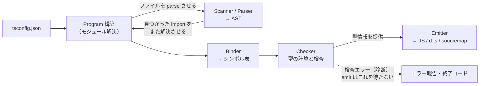

TypeScript で記載したプログラム（`.ts`）は、`.js` に変換されてから実行されます。毎日この変換のお世話になっているのに、中で何が起きているかは見たことがない — そんな方が多いのではないでしょうか？

筆者も「型チェックをした後、型を消して JS にしている」くらいの解像度で理解していました。ただ、あらためて考えると「チェックして、消す」の中身はまるごとブラックボックスです。そもそも `.ts` が `.js` になるまでに、どんなプロセスを踏んでいるのか。それが知りたくて、Express の Hello World という最小の題材を TypeScript 7.0.2 でコンパイルし、各段階でできる中間生成物を実際に取り出しながら、TypeScript が JavaScript になるまでを追いかけました。

## この記事の前提

- 環境: TypeScript 7.0.2 / Node.js v25.9.0 / express 5.2.1 / @types/express 5.0.6 / macOS
- コンパイラ: TypeScript 7.0.2 に付属する `tsc` を使います。swc や esbuild などの別系統のコンパイラではありません（これらが速い理由は最後の「学び」で回収します）。パイプラインの段階構成自体は 5 系の tsc でも同じなので、5.x をお使いの方もそのまま読めます
- 対象: 単発の `tsc` 実行に絞ります。`--watch`・`--incremental`・project references は「Program をどこまで作り直さずに済ませるか」という話で、この記事の流れの外側にあります
- 題材: Express で Hello World を返すだけの `index.ts` 1 ファイル
- 記事中のログ・エラーメッセージ・数値は、すべて筆者が上記環境で実際に採取したものです。モジュール解決のログと所要時間は tsc のオプション（`--traceResolution` / `--extendedDiagnostics`）でそのまま再現できます。AST やシンボルのダンプは Compiler API で書いた小さな採取スクリプトによるものです

## 全体像

先に登場人物を並べます。tsc の内部は、次の段階を経るパイプラインです。

- **Program 構築** — tsconfig の `files` / `include` で指定したルートファイル群から import や型参照を辿り、コンパイル対象ファイルの一覧（ファイルグラフ）を確定する。import に書いた名前（`"express"` など）から実ファイルを突き止める「モジュール解決」はここで行われる。標準ライブラリの型定義（lib）と `node_modules/@types` の自動取り込みもここ
- **Scanner / Parser** — ファイルごとに、ソースコードを字句に刻み（Scanner）、AST（構文木）に組み上げる（Parser）
- **Binder** — ファイルごとに AST を歩き、「この名前はこの宣言のこと」という対応表（シンボル表）を作る
- **Checker** — シンボル表を突き合わせて型を計算・検査する。シンボルと型の解決で初めてファイルを跨ぐ。検査の結果はエラー報告（診断）として tsc の終了コードになる
- **Emitter** — AST から型を消し、構文を変換して JS・`.d.ts`・sourcemap を書き出す



先に結論を言ってしまいます。tsc の仕事は大きく「型を検査する」と「型を消して JS を書き出す」に分かれていて、**型消しはファイル 1 枚で完結できるのに、型検査はプロジェクト全体（Program）が必要**という非対称性があります。図の矢印にはその予告が入っていて、既定設定の tsc では Emitter も Checker から型情報を一部受け取ります（どこで使うかは学びで触れます）。ただし Emitter が待つのは型情報だけ。検査の「合格」は待たないので、型エラーが出ても JS は出力されます（`noEmitOnError` を付けない限り）。点線の先 — エラー報告と emit が別ルートであること — がこの記事の背骨です。

以降、この非対称性を段階ごとの中間生成物で確かめていきます。

## 課題 — 「コンパイルしている」ことは知っていても、答えられない質問がある

TypeScript を書いていると、ふとした場面でこんな質問に出くわします。

- どうしてコンパイルや CI の型チェックはこんなに時間がかかるのか。tsx や Vite だと一瞬で動き出すのは何が違うのか
- そもそも、どうやって `.ts` から `.js` を作っているのか

どちらも「JS になるまでに何が行われているか」を知っていれば答えられるはずの質問です。答えられるようになるには、パイプラインの各段階が吐く中間生成物を実物で見るのが早道です。題材は誰でも書いたことのある Express の Hello World にしました。

```typescript
// index.ts
import express from "express";

const app = express();
const port: number = 3000;

app.get("/", (req, res) => {
  res.send("Hello World!");
});

app.listen(port, () => {
  console.log(`Example app listening on port ${port}`);
});
```

たった 12 行ですが、外部パッケージの import・型注釈・アロー関数・テンプレートリテラルが入っていて、パイプラインの全段階に仕事があります。

## 試したこと — 中間生成物を段階ごとに取り出す

### 段階 1: Program 構築 — 12 行のファイルが 201 ファイルの Program になる

`tsc --traceResolution` で、`import express from "express"` の 1 行がどう解決されるかを追いました。ログの要点だけ抜きます。

```text
======== Resolving module 'express' from '.../index.ts'. ========
Explicitly specified module resolution kind: 'NodeNext'.
Resolving in CJS mode with conditions 'require', 'types', 'node'.
Loading module 'express' from 'node_modules' folder, target file types: TypeScript, JavaScript, Declaration, JSON.
Found 'package.json' at '.../node_modules/express/package.json'.
'package.json' does not have a 'typesVersions' field.
'package.json' does not have a 'typings' field.
'package.json' does not have a 'types' field.
（中略 — express 本体に型が見つからないので、@types/express を見に行く。ここからは @types/express 側の package.json）
'package.json' has 'types' field 'index.d.ts' that references '.../node_modules/@types/express/index.d.ts'.
File '.../node_modules/@types/express/index.d.ts' exists - use it as a name resolution result.
======== Module name 'express' was successfully resolved to '.../node_modules/@types/express/index.d.ts' with Package ID '@types/express/index.d.ts@5.0.6'. ========
```

見どころは 2 つあります。express 本体の package.json に `types` フィールドが無いことを確認してから `@types/express` に探しに行っていること。そして最終的に解決されたのが JS の実装ではなく `.d.ts`（型だけの窓口）であることです。JS ライブラリは、実装とは別枠の型定義ファイルとして Program に組み込まれます。言い換えると、tsc は express の実装 JS を一度も読みません。読むのは型定義だけで、実行時に `require("express")` が読み込む本体とは別物です。

こうして辿った結果のファイルグラフを Compiler API で出すと、201 ファイルありました。うち @types 関係の 10 件だけ抜き出します。

```text
total: 201 files
  node_modules/@types/send/index.d.ts
  node_modules/@types/qs/index.d.ts
  node_modules/@types/range-parser/index.d.ts
  node_modules/@types/express-serve-static-core/index.d.ts
  node_modules/@types/http-errors/index.d.ts
  node_modules/@types/serve-static/index.d.ts
  node_modules/@types/connect/index.d.ts
  node_modules/@types/body-parser/index.d.ts
  node_modules/@types/express/index.d.ts
  index.ts
```

自分が書いたのは `index.ts` の 1 ファイルなのに、Program は 201 ファイルです。ただし内訳を見ると、import が連れてきた @types/express 系は 9 ファイルで、残りの大半は `target: es2022` から決まる標準ライブラリの型定義（lib.\*.d.ts 群）と、`node_modules/@types` に置いてあるだけで自動で取り込まれる @types/node（とその依存 undici-types）でした。import で辿られた分より、自動取り込みの方が量としては支配的です。エディタで小さなファイルを開いただけなのに裏で大量の型定義が読まれている、という体感の正体がこの一覧です。

### 段階 2: Parser — AST を見る

次に `index.ts` の AST をダンプします（深さ 4 まで）。

```text
SourceFile
  ImportDeclaration
    ImportClause
      Identifier "express"
    StringLiteral "express"
  FirstStatement
    VariableDeclarationList
      VariableDeclaration
        Identifier "app"
        CallExpression
  FirstStatement
    VariableDeclarationList
      VariableDeclaration
        Identifier "port"
        NumberKeyword
        FirstLiteralToken
  ExpressionStatement
    CallExpression
      PropertyAccessExpression
        Identifier "app"
        Identifier "get"
      StringLiteral "/"
      ArrowFunction
        Parameter
        Parameter
        EqualsGreaterThanToken
        Block
  ExpressionStatement
    CallExpression
      PropertyAccessExpression
        Identifier "app"
        Identifier "listen"
      Identifier "port"
      ArrowFunction
        EqualsGreaterThanToken
        Block
  EndOfFile
```

ソースの 5 つの文がそのまま 5 本の枝になっています。注目したいのは `port` の宣言です。`Identifier "port"` の隣に `NumberKeyword`（`: number` の型注釈）がノードとして残っています。この時点では型注釈もただの構文で、まだ何の意味も持っていません。

### 段階 3: Binder — シンボル表を見る

Binder は AST を歩いて「この名前はこの宣言のこと」というシンボル表をファイルごとに作ります。シンボルを作るのは Binder ですが、外から覗く窓口は Checker 側の API（`getSymbolAtLocation`）にしかないため、それ経由でトップレベルの宣言 3 つを引き出すと、こう見えます。

```text
express: flags=[Alias, ModuleMember, ExportDoesNotSupportDefaultModifier, Classifiable], declarations=1
app: flags=[BlockScopedVariable, Variable, Value, ModuleMember, BlockScoped, ExportDoesNotSupportDefaultModifier], declarations=1
port: flags=[BlockScopedVariable, Variable, Value, ModuleMember, BlockScoped, ExportDoesNotSupportDefaultModifier], declarations=1
```

`app` と `port` は普通の変数シンボルですが、import した `express` だけ `Alias` です。「他ファイルのどこかにある本体を指す別名」とマークされているだけで、本体がどこの何なのかはまだ解決されていません。Binder はあくまでファイル単位の仕事だからです。

### 段階 4: Checker — シンボル解決で初めてファイルを跨ぐ

Alias の正体を突き止めるのは Checker です。`checker.getAliasedSymbol()` で `express` を解決させると:

```text
local symbol : "express" (Alias)
resolved to  : "e" (declarations: FunctionDeclaration, ModuleDeclaration)
```

解決先はシンボル `"e"` で、宣言は関数と namespace の 2 つ。段階 1 のモジュール解決が指した先である `@types/express/index.d.ts` を開くと、たしかに `declare function e(...)` と `declare namespace e` が本体でした（export = e されているやつです）。段階 1 の Program 構築が跨いだのは「どのファイルが要るか」という所在のレベルでしたが、「このシンボルの正体は他ファイルのあの宣言」という**意味のレベルでファイル境界を越えるのは Checker の仕事**だと、ここで実物として確認できます。

型の計算も Checker です。`const app = express()` の `app` に型を問い合わせると:

```text
typeof app = Express
```

注意したいのは、Checker が全部の型を事前に計算しているわけではないことです。問い合わせたノードから必要な分だけ要求駆動で計算してキャッシュします。「エディタでホバーした瞬間に型が出る」の裏側はこの遅延評価です。そしてこうした検査の結果はエラー報告（診断）にまとめられ、tsc の終了コードになります。CI で回す `tsc --noEmit` が見ているのは、この診断と終了コードです。

### 段階 5: Emitter — 型が消え、構文が書き換わる

`tsc -p tsconfig.json` の出力がこちらです。

<!-- prettier-ignore -->
```javascript
// dist/index.js
"use strict";
var __importDefault = (this && this.__importDefault) || function (mod) {
    return (mod && mod.__esModule) ? mod : { "default": mod };
};
Object.defineProperty(exports, "__esModule", { value: true });
const express_1 = __importDefault(require("express"));
const app = (0, express_1.default)();
const port = 3000;
app.get("/", (req, res) => {
    res.send("Hello World!");
});
app.listen(port, () => {
    console.log(`Example app listening on port ${port}`);
});
//# sourceMappingURL=index.js.map
```

見比べると Emitter の仕事が 4 種類あるのが分かります。

- **型の消去**: `const port: number = 3000` → `const port = 3000`。`: number` は跡形もない
- **モジュール構文の変換**: `import express from "express"` → `require` + `__importDefault` ヘルパー。`module: nodenext` で package.json が `"type": "commonjs"` なので CommonJS 出力です（`type` を書かない場合の既定も同じ。段階 1 のログにあった `Resolving in CJS mode` も、モジュール解決の側から見た同じ判定の結果です）。`esModuleInterop` の実体がこのヘルパー関数で、`(0, express_1.default)()` という見慣れない呼び方は `this` を渡さないためのカンマ演算子のイディオムです
- **TS 固有の実行時構文の組み立て**: `enum`・`namespace`・parameter property は「消す」対象ではなく、JS のコードへ変換される対象。今回の題材には無いので出てきませんが、この違いが学びで効いてきます
- **残すものは残す**: `target: es2022` なのでアロー関数もテンプレートリテラルもそのまま

同時に出る `.d.ts` は、export が無いファイルなので `export {};` の 1 行だけ。ただし `.d.ts` は「推論された型を書き出す」産物なので、生成には Checker の型情報が必要です。sourcemap（`index.js.map`）には `"sources":["../index.ts"]` と mappings が入っていて、実行時エラーのスタックトレースを元の TS の行に引き戻すための対応表になっています（Node で実際に効かせるには `--enable-source-maps` が要ります。既定では読まれません）。

冒頭の「型を消して JS にしている」は半分だけ正しくて、残り半分はモジュール構文と TS 固有構文の書き換えでした。

### 計測: 各段階の所要時間

`--extendedDiagnostics` で所要時間の内訳も採れました。

```text
Files:              201
Config time:     0.003s
Parse time:      0.027s
Bind time:       0.006s
Check time:      0.132s
Emit time:       0.005s
Total time:      0.180s
```

1 つ注意があって、`Parse time` は段階 2 だけの時間ではなく、Program 構築（段階 1）を丸ごと含んだ時間です。ファイル読み込み・モジュール解決・parse は一塊で相互に呼び合いながら走るので、計測にも「Program 構築」という独立した行がありません。

その上で数字を見ると、12 行の Hello World ですら **Check が全体の 7 割超**を占め、Emit は Check の 26 分の 1 です。エディタが重いときに疑うべきは Checker であり、型検査を捨てたツールが速いのは当然だ、という数字になっています。

もう 1 つ、型検査だけを止めた計測も採れます。`--noCheck` を付けて同じビルドを回すと:

```text
Files:              201
Config time:    0.003s
Parse time:     0.027s
Bind time:      0.009s
Check time:     0.000s
Emit time:      0.016s
Total time:     0.061s
```

Check だけが 0.000s になり、Program 構築（201 ファイル）も Parse も Bind もそのまま残っています。つまり tsc は、型チェックをしないときでも Program を作り、Binder まで通してから emit します。スキップできるのは「検査」だけで、名前の正体を知るための「解決」は emit にも必要だからです。面白いのは Emit が 0.005s から 0.016s に増えていることで、これは `declaration: true` の `.d.ts` を作るのに必要な型計算が、Check から Emit 側に移っただけだからです（Check 0.000s なのに、内訳では型が 1486 個計算されていました）。それでも合計は 0.180s → 0.061s と 3 分の 1。「検査を捨てると速い」をこの規模でも実測できます。

## 結果

- 12 行の `index.ts` から 201 ファイルの Program が構築された。`import "express"` の解決先は実装の JS ではなく `@types/express/index.d.ts`（段階 1）
- AST の時点では `: number` は `NumberKeyword` というただの構文ノード（段階 2）
- Binder のシンボル表はファイル単位で、import した `express` は正体不明の Alias のまま（段階 3）
- ファイルを跨いで Alias の正体（シンボル `e`）と型（`Express`）を突き止めたのは Checker（段階 4）
- emit された JS からは型が消え、モジュール構文が CommonJS に書き換わっていた（段階 5）
- 所要時間は Check 0.132s に対して Emit 0.005s。`--noCheck` にしても Program 構築と Bind は走り、全体は 3 分の 1 になった（計測）

そして、この一連の変換を経た JS はちゃんと動きます。

```text
$ node dist/index.js
Example app listening on port 3000

$ curl -s -i http://localhost:3000/
HTTP/1.1 200 OK
X-Powered-By: Express
Content-Length: 12
（そのほかのレスポンスヘッダは省略）

Hello World!
```

## 学び

- **型消し（JS の emit）はファイル 1 枚で完結できる。** 型注釈を落とし、モジュール構文を書き換える — どちらも 1 ファイル内の情報だけで決められる。だから esbuild の TS→JS 変換や Node の type stripping は、ファイル単位で並列に、型の解決をせずに変換できる（esbuild はバンドルのためにパスの解決はしますが、「この識別子は型か値か」を知るための型の解決はしません）
- **型検査（Check）は Program 全体が必要。** `express` の型ひとつ知るにも、`@types/express` へ辿り着くモジュール解決とファイル跨ぎのシンボル解決が要る。時間の 7 割が Check に消えるのはこのため
- この非対称性を運用に落とすと、「開発ループは型剥がし系ツールで速く回し、型の保証はエディタの tsserver と CI の `tsc --noEmit` に分業させる」という現代の標準構成になる

ただし「ファイル 1 枚で完結できる」は原理の話で、既定設定の tsc 自身はそう動いていません。emit の途中で型情報を参照する仕事が 2 つあるからです。1 つは、型としてしか使っていない import を出力から消す判断（import elision）。もう 1 つは、他ファイル由来の `const enum` を定数に展開するインライン化です。ファイル単体の型剥がしを本当に成立させたいときは、この 2 つと「TS 固有の実行時構文」をフラグで封じることになります。

| ファイル単体で剥がせない要因 | 封じるフラグ |
| --- | --- |
| import elision（型か値かの判断に型情報が要る） | `verbatimModuleSyntax` |
| 他ファイル由来の `const enum` のインライン展開 | `isolatedModules` |
| `enum`・`namespace`・parameter property（消すのではなくコード生成が要る） | `erasableSyntaxOnly` |

`enum` が最近避けられがちな理由もこの表の 3 行目です。enum は型のように見えて JS のオブジェクトを生成する構文なので、「型を剥がすだけ」のツールでは扱えません。

課題に挙げた 2 つの質問にも、ここまでの材料で答えられます。「どうしてコンパイルに時間がかかるのか」— 時間を食っているのは変換ではなく型検査で、それも 12 行のコードの検査に 201 ファイルの Program 全体を突き合わせる必要があるからです。tsx や Vite が一瞬なのは、その型検査をまるごと捨てて、ファイル単位の型剥がしだけをしているから。「どうやってコンパイルしているのか」— Program 構築 → Parse → Bind → Check → Emit の 5 段階です。tsconfig からファイルグラフを確定し、ファイルごとに AST とシンボル表を作り、ファイルを跨いで型を検査し、最後に型を消した JS を書き出す。本文で見てきた中間生成物が、その各段階の実物です。

今回はコンパイラの中まででしたが、次はこうして生まれた JS が V8 とイベントループの上でどう走るのかを、同じように中間生成物ベースで確かめていきたいですね。

